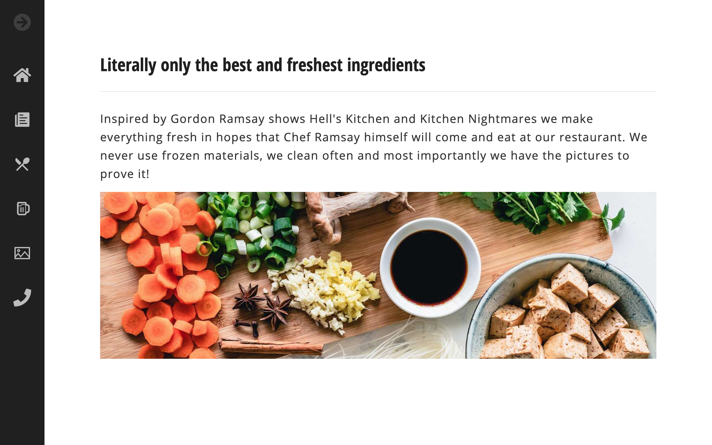
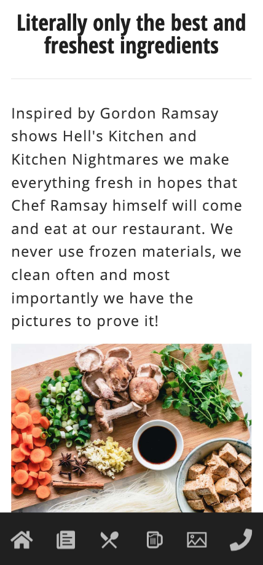
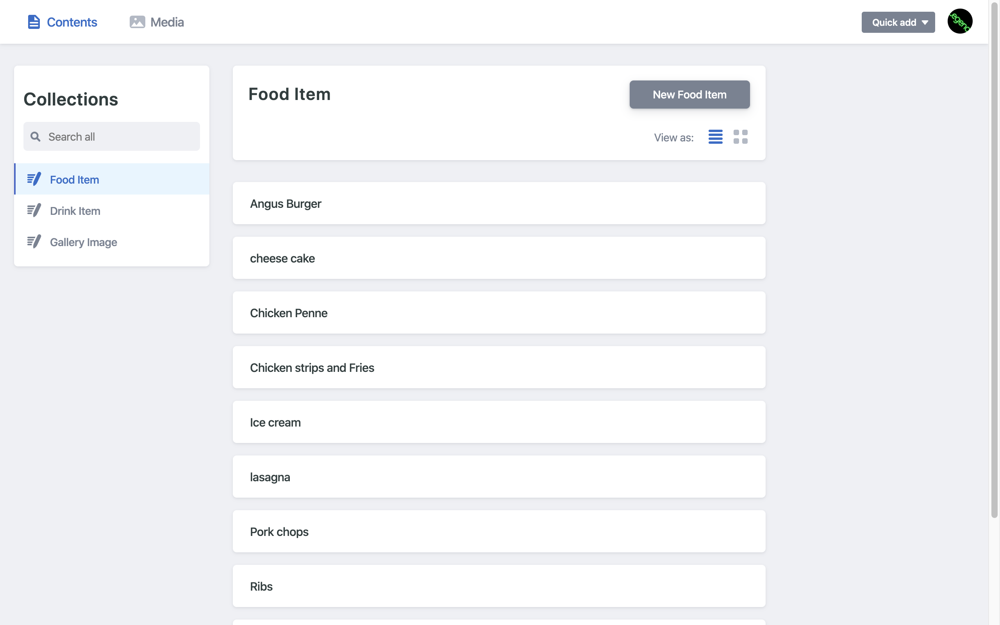

# Eatery

> A restaurant site created with Gatsby (React) and Netlify CMS

## Table of contents

- [General info](#general-info)
- [Screenshots](#screenshots)
- [Technologies](#technologies)
- [Setup](#setup)
- [Features](#features)
- [Status](#status)
- [Inspiration](#inspiration)
- [Contact](#contact)

## General info

I created this because this is the perfect project to put my skills to the test. This project is a frontend and backend project where you can easily add to the menus and the gallery with a CMS which requires authentication to get into.

## Screenshots





## Technologies

- HTML
- CSS
- Javascript
- React
- Gatsby
- Font Awesome
- Styled Components
- Authentication
- Netlify

## Setup

```
npm install
npm run develop
```

## Features

List of features ready and TODOs for future development

- Responsive
- Data fetched from a CMS
- Authentication
- Reservation form

## Status

Project is: _finished_

## Contact

Created by [Johnathan Brown](https://www.johnathanbrown.me) - feel free to contact me!
